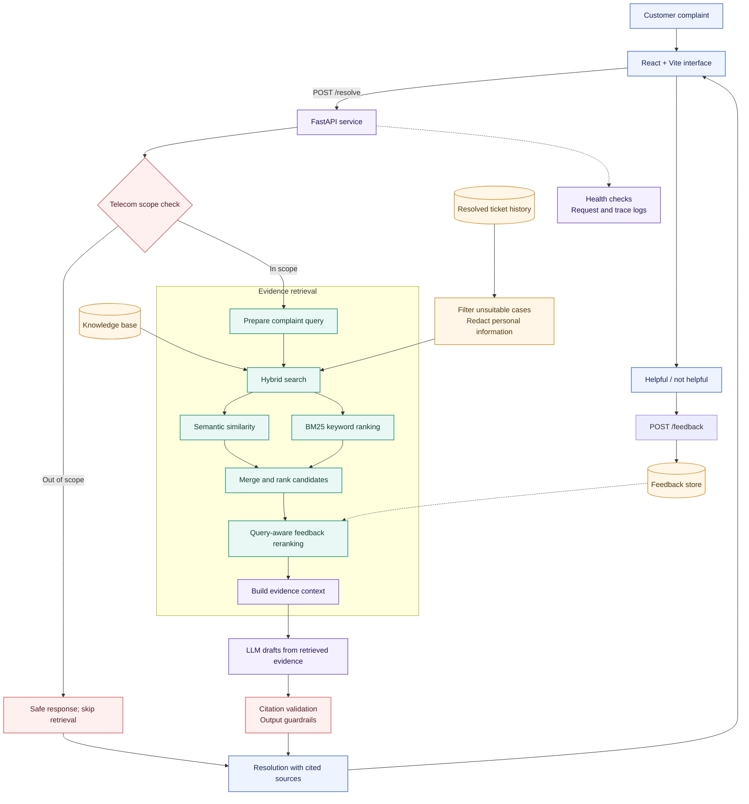

<!-- ============================================================
NEXOLVE RESOLUTION COPILOT — README
Editorial redesign: no emoji, muted palette, depth on demand
============================================================ -->

<div align="center">


<br/>

[]()
[]()
[]()
[]()

<br/>

### From complaint to confident next step.

**A semantic support assistant for telecom service teams**

*Understand the issue · Find relevant history · Draft a grounded next step*

</div>

---

## Overview

|  |  |
| :--- | :--- |
| **Purpose** | Move support agents from a customer complaint to a cited, reviewable next step |
| **Method** | Hybrid retrieval (semantic + BM25) → grounded LLM drafting → citation validation |
| **Safety** | Telecom scope guard · evidence thresholds · safe abstention when evidence is thin |
| **Retrieval** | Recall@1 **56.8%** · Recall@5 **84.3%** · nDCG@5 **0.715** <sub>*synthetic benchmark*</sub> |

## Quick start

```powershell
# Start the API
uvicorn app.main:app --reload --host 127.0.0.1 --port 8000
```

```powershell
# Start the UI (from /frontend)
npm install
npm run dev -- --port 5174
```

Point the frontend at the local API and configure LLM credentials via the project's environment files. Never commit secrets.

<details>
<summary>&nbsp;Pre-production implementation check</summary>

<br/>

- [ ] Telecom scope guard runs before retrieval
- [ ] Frontend feedback payload matches the API feedback schema
- [ ] Out-of-scope complaint returns no irrelevant sources
- [ ] In-scope complaint shows source metadata and validated citations
- [ ] Helpfulness feedback is accepted end-to-end

</details>

---

## How it works



**Request lifecycle**

1. Complaint enters via the web application
2. API checks whether the issue is in the supported telecom domain
3. For in-scope complaints, the retrieval layer searches support articles and eligible resolved cases using semantic and BM25 signals; feedback from similar queries can adjust ranking
4. Retrieved evidence is assembled as the only factual basis for the generated recommendation
5. The answer is checked for valid source citations and safe output before it is returned
6. The UI presents the resolution and its sources; the agent or customer rates whether it helped

---

## Why this project exists

> Support agents often search old cases with a few keywords. That works when customers use the same words as the ticket title; it misses when they describe the same fault differently.
> >
> A customer might say, *"My broadband drops every evening while I'm working."* A useful assistant should recognize the connectivity problem, retrieve relevant support articles and resolved cases, and help the agent respond with clear steps grounded in those sources.
> >
> Nexolve makes that workflow faster while keeping the evidence visible. Retrieved sources inform the recommendation — the agent remains responsible for reviewing it.

<details>
<summary>&nbsp;Capabilities</summary>

<br/>

- Accepts a free-text customer complaint in a web interface
- Extracts complaint signals: product, issue category, severity, sentiment
- Searches support knowledge and historical resolved tickets with semantic and lexical retrieval
- Uses query-aware feedback signals to adjust rankings for similar future complaints
- Drafts a step-by-step response from retrieved evidence
- Returns visible source references; validates citations against retrieved evidence
- Applies telecom scope and response guardrails, with safe handling when evidence is insufficient
- Captures helpfulness feedback; exposes service health and request diagnostics

</details>

---

## Grounding and safety

The assistant prefers a useful abstention over a confident answer without evidence.

| Principle | What it means |
| :--- | :--- |
| Source-grounded generation | Recommendations are based on retrieved material, not invented telecom procedures |
| Citation validation | Source identifiers in the answer must correspond to sources actually retrieved for that request |
| Evidence threshold | If retrieval does not find sufficiently relevant material, the response explains the evidence gap and avoids unsupported troubleshooting |
| Domain scope | Non-telecom complaints receive a safe out-of-scope response, without unrelated telecom articles presented as relevant |
| Ticket hygiene | Unsuitable historical cases are excluded and personal information is redacted before indexing or use |
| Human review | Agents verify actions that affect accounts, billing, equipment, or service status |

---

## Evaluation

> [!IMPORTANT]
> Figures are from the offline synthetic evaluation artifacts in the project folder (`data/eval/retrieval_results.json`, `data/eval/answer_results.jsonl`) — a measured run of the project hybrid retriever on its synthetic labeled benchmark. They are not production traffic metrics.

| Area | Observed project result |
| :--- | :--- |
| Retrieval relevance | **400 synthetic complaint queries** — Recall@1 **56.8%**, Recall@3 **77.0%**, Recall@5 **84.3%**; MRR **0.672**, nDCG@5 **0.715** |
| Retrieval latency | p50 **46.2 ms** / p95 **91.1 ms** across the recorded offline run; max **226.3 ms** — local retrieval cost only, not end-to-end service latency |
| Answer generation | **1 of 5 (20%)** successful runs; **4 of 5** failed with provider rate limits — sample too small and rate-limited to claim reliable generation |
| Citation validation | **1 of 1 generated answers (100%)** had a citation and all cited IDs were retrieved — this checks ID validity, not whether the cited source truly supports every claim |

<details>
<summary>&nbsp;Further exploration: retrieval experiments · feedback-aware ranking · evolving taxonomy · out-of-domain behavior</summary>

<br/>

- **Retrieval experiments** — compare lexical BM25, semantic similarity, and hybrid retrieval on the same labeled complaint set. Include paraphrases, spelling mistakes, short complaints, and multi-symptom complaints. Track which source type — article or historical case — provides the strongest evidence.
- **Feedback-aware ranking** — use helpful and not-helpful feedback as a ranking signal for semantically similar future queries. Bounded by design: feedback adjusts candidate ordering, never relevance, source quality, domain scope, or safety rules. Log the ranking version so experiments can be compared and rolled back.
- **Evolving taxonomy and data** — monitor new product names, issue categories, and emerging ticket clusters. Controlled ingestion validates records, redacts sensitive fields, deduplicates cases, and refreshes indexes. Version the corpus and taxonomy so results can be traced to the data that produced them.
- **Out-of-domain and low-evidence behavior** — include deliberate negative examples (vehicle repair, medical, unrelated consumer questions). Expected behavior: decline domain-specific guidance and avoid displaying unrelated retrieved sources as supporting evidence.

</details>

---

## Production scale considerations

<details>
<summary>&nbsp;Retrieval and data</summary>

<br/>

- Move from in-process indexes to a managed vector store or search service when corpus size, concurrency, or update frequency requires it; retain lexical retrieval for exact product codes and known terms
- Use approximate nearest-neighbor search, metadata filters, and bounded candidate sets to control latency
- Ingest changes asynchronously; validate, redact, deduplicate, and version documents before publishing a new index
- Keep ticket and knowledge-article permissions and retention rules separate where required
- Support index rebuilds and rollback to a known-good corpus snapshot

</details>

<details>
<summary>&nbsp;Service reliability</summary>

<br/>

- Keep the API stateless and scale it horizontally behind a load balancer
- Put LLM calls behind timeouts, bounded retries, rate limits, and circuit breakers; return a clear evidence-based fallback if the provider is unavailable
- Cache safe, repeatable retrieval work where appropriate; do not cache responses containing customer-specific data without a reviewed privacy design
- Add request IDs, structured logs, distributed traces, and metrics while avoiding complaint text and personal data in logs
- Protect endpoints with authentication, authorization, input-size limits, abuse controls, and secrets management

</details>

<details>
<summary>&nbsp;Model and feedback governance</summary>

<br/>

- Pin and record embedding, reranker, prompt, and generation model versions
- Treat feedback as untrusted input; rate-limit it, deduplicate it, and monitor for manipulation or drift
- Use offline evaluation and staged rollout before a ranking or model change reaches all agents
- Track source freshness and answer quality together — a fluent answer over stale evidence is still a failure

</details>

---

## Technology

| Layer | Stack |
| :--- | :--- |
| Web UI | React · Vite |
| API | Python · FastAPI |
| Retrieval | Sentence Transformers embeddings · BM25 lexical search |
| Generation | Configured LLM provider (Groq in the reviewed setup) |
| Operations | Health endpoint · structured request logs · evaluation-driven monitoring |

Confirm exact dependency versions and provider configuration in the project's environment files before deployment.

---

<div align="center">

<sub>Evidence first. Clear next steps. Better support conversations.</sub>

</div>
