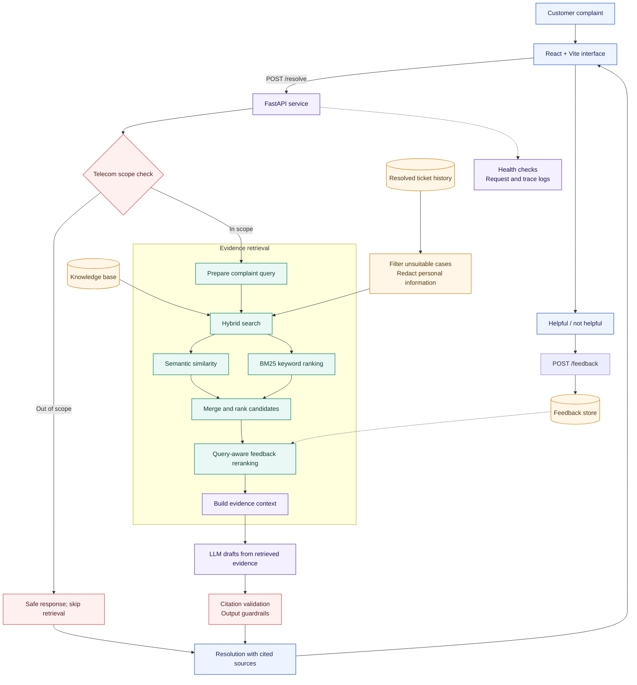

<!-- ============================================================
NEXOLVE RESOLUTION COPILOT — README
Visual redesign: hierarchy, collapsible depth, tables over walls
============================================================ -->

<div align="center">


<br/>

[]()
[]()
[]()
[]()
[]()

### Turn a customer complaint into evidence-backed support guidance.

**A semantic support assistant for telecom service teams**

*Understand the issue · Find relevant history · Draft a grounded next step*

</div>

---

## 🎯 At a glance

|  |  |
| :--- | :--- |
| 🧭 **Purpose** | Help support agents move from a complaint to a cited, reviewable next step |
| 🔍 **How** | Hybrid retrieval (semantic + BM25) → grounded LLM drafting → citation validation |
| 🛡️ **Safety** | Telecom scope guard, evidence thresholds, safe abstention |
| 📊 **Retrieval** | **56.8%** Recall@1 · **84.3%** Recall@5 · **0.715** nDCG@5 *(synthetic benchmark)* |

<br/>

## ⚡ Quick start

```powershell
# 1. Start the API
uvicorn app.main:app --reload --host 127.0.0.1 --port 8000
```

```powershell
# 2. Start the UI (from /frontend)
npm install
npm run dev -- --port 5174
```

> Point the frontend at the local API and set LLM credentials via the project's environment files. **Never commit secrets.**

<details>
<summary><b>✅ Current implementation check — run before calling it production-ready</b></summary>

<br/>

- [ ] Telecom scope guard runs **before** retrieval
- [ ] Frontend feedback payload matches the API feedback schema
- [ ] Out-of-scope complaint returns **no** irrelevant sources
- [ ] In-scope complaint shows source metadata **and** validated citations
- [ ] Helpfulness feedback is accepted end-to-end

</details>

<br/>

---

## 🧩 How it works



**Request lifecycle**

1. 💬 Complaint enters via the web app
2. 🛡️ API checks telecom domain scope
3. 🔍 Hybrid retrieval over articles **and** eligible resolved cases *(with query-aware feedback reranking)*
4. 🧠 LLM drafts **only** from retrieved evidence
5. ✅ Citations validated + output guardrails applied
6. ⭐ Agent/customer rates helpfulness → feedback loop

<br/>

## 🧠 Why it exists

> [!NOTE]
> Support agents usually search old cases with a few keywords. That works when customers use the same words as the ticket title — and fails when they describe the same fault differently.
> >
> *"My broadband drops every evening while I'm working."* should still surface the right articles and resolved cases, with clear steps **grounded in those sources**. Nexolve makes that fast while keeping the evidence visible. The assistant informs; **the agent remains responsible** for the response.

<details>
<summary><b>🔧 What it does (feature list)</b></summary>

<br/>

- Accepts a free-text customer complaint in a web interface
- Extracts complaint signals: product, issue category, severity, sentiment
- Searches knowledge + resolved tickets with **semantic and lexical** retrieval
- Uses query-aware feedback to adjust rankings for similar future complaints
- Drafts a step-by-step response from retrieved evidence
- Returns **visible source references** and validates citations against evidence
- Applies telecom scope + response guardrails, with safe handling when evidence is thin
- Captures helpfulness feedback; exposes health checks and request diagnostics

</details>

<br/>

## 🛡️ Grounding & safety

The assistant prefers a **useful abstention** over a confident answer without evidence.

| Principle | What it means |
| :--- | :--- |
| 📚 Source-grounded generation | Recommendations come from retrieved material, never invented procedures |
| 🔖 Citation validation | Cited source IDs must correspond to sources actually retrieved for that request |
| ⚖️ Evidence threshold | If retrieval is weak, explain the evidence gap — no unsupported troubleshooting |
| 📡 Domain scope | Non-telecom complaints get a safe out-of-scope response, with **no** unrelated articles shown |
| 🧹 Ticket hygiene | Unsuitable cases excluded; personal information redacted before indexing/use |
| 👤 Human review | Agents verify any action affecting accounts, billing, equipment, or service status |

<br/>

## 📊 Evaluation snapshot

> [!IMPORTANT]
> Figures are from offline synthetic evaluation artifacts (`data/eval/retrieval_results.json`, `data/eval/answer_results.jsonl`) — a measured run of the project hybrid retriever on its synthetic labeled benchmark. **Not production traffic metrics.**

| Area | Observed result |
| :--- | :--- |
| 🔍 Retrieval relevance | **400 synthetic queries** — Recall@1 **56.8%** · Recall@3 **77.0%** · Recall@5 **84.3%** · MRR **0.672** · nDCG@5 **0.715** |
| ⏱️ Retrieval latency | p50 **46.2 ms** · p95 **91.1 ms** · max **226.3 ms** *(local retrieval cost only)* |
| ✍️ Answer generation | **1 of 5 (20%)** succeeded; 4 failed on provider rate limits — sample too small to claim reliability |
| 🔖 Citation validity | **1 of 1 answers (100%)** cited sources with valid retrieved IDs *(validates IDs, not claim-level support)* |

<details>
<summary><b>🔬 Additional exploration — retrieval experiments, feedback ranking, taxonomy, negative examples</b></summary>

<br/>

- **Retrieval experiments** — compare BM25 vs semantic vs hybrid on a labeled complaint set: paraphrases, typos, short complaints, multi-symptom complaints. Track whether articles or historical cases provide stronger evidence.
- **Feedback-aware ranking** — helpful/not-helpful feedback adjusts candidate ordering for similar future queries. Bounded by design: it never overrides relevance, source quality, scope, or safety. Ranking version is logged for comparison and rollback.
- **Evolving taxonomy & data** — monitor new products, issue categories, and ticket clusters. Controlled ingestion validates, redacts, deduplicates, and versions the corpus and taxonomy.
- **Out-of-domain & low-evidence behavior** — deliberate negative examples (vehicle repair, medical, unrelated consumer questions) must trigger a decline, without displaying unrelated retrieved sources as support.

</details>

<br/>

## 🚀 Production scale considerations

<details>
<summary><b>🗂️ Retrieval & data</b></summary>

<br/>

- Move to a managed vector store / search service when corpus size, concurrency, or update frequency demands it; **keep lexical retrieval** for exact product codes and known terms
- ANN search, metadata filters, and bounded candidate sets to control latency
- Ingest asynchronously: validate → redact → deduplicate → version → publish
- Keep ticket and knowledge-article permissions/retention rules separate where required
- Support index rebuilds and rollback to a known-good corpus snapshot

</details>

<details>
<summary><b>🔁 Service reliability</b></summary>

<br/>

- Stateless API, scaled horizontally behind a load balancer
- LLM calls behind timeouts, bounded retries, rate limits, and circuit breakers — with a clear evidence-based fallback if the provider is down
- Cache safe, repeatable retrieval work; never cache customer-specific responses without a reviewed privacy design
- Request IDs, structured logs, traces, metrics — **without** complaint text or personal data in logs
- Authentication, authorization, input-size limits, abuse controls, secrets management

</details>

<details>
<summary><b>🧭 Model & feedback governance</b></summary>

<br/>

- Pin and record embedding, reranker, prompt, and generation model versions
- Treat feedback as untrusted input: rate-limit, deduplicate, monitor for manipulation or drift
- Offline evaluation and staged rollout before any ranking/model change reaches all agents
- Track source freshness and answer quality together — a fluent answer over stale evidence is still a failure

</details>

<br/>

## 🧰 Technology

| Layer | Stack |
| :--- | :--- |
| 🖥️ Web UI | React · Vite |
| ⚙️ API | Python · FastAPI |
| 🔍 Retrieval | Sentence Transformers embeddings · BM25 lexical search |
| ✍️ Generation | Configured LLM provider *(Groq in the reviewed setup)* |
| 📈 Operations | Health endpoint · structured request logs · evaluation-driven monitoring |

> Confirm exact dependency versions and provider configuration in the project's environment files before deployment.

---

<div align="center">

<sub>Evidence first. Clear next steps. Better support conversations.</sub>

</div>
